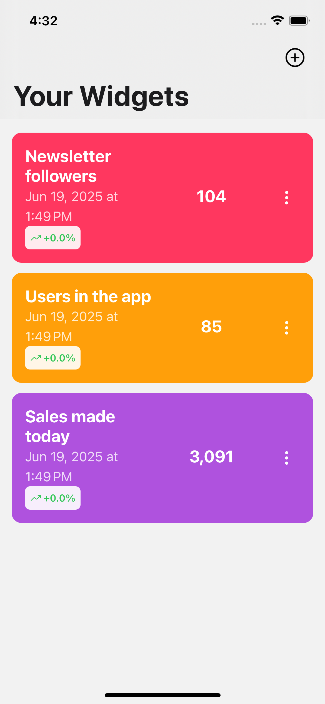

### Datadget

Datadget lets you turn any HTTP API into beautiful, glanceable widgets. Create a widget by pointing to a JSON endpoint, choose a value with a visual JSON path picker, and see live values, charts, and trends. Supports configurable refresh intervals and iOS Home Screen widget syncing.

### Screenshots

<div align="center">
  
  
  
</div>

### Features

- **Create widgets from any API**: Provide an API URL, optional headers, and select the value with a **JSON Path** picker.
- **Custom display**: Name, color, prefix/suffix, and optional icon per widget.
- **Auto-refresh**: Choose refresh intervals from **15 min** to **2 days**; background refresh handled for you.
- **History and charts**: See value history and a simple line chart across 1h / 24h / 7d / 30d.
- **Trends and analytics**: Growth percentage, short/long-term trend, and summary stats.
- **Persistence**: Widgets and history stored locally (SQLite) and restored on launch.
- **i18n**: English and French translations.

### Quick start

1. Install dependencies

```bash
yarn
```

2. Run the app

```bash
npx expo start
```

Open on iOS simulator, Android emulator, or a development build. For iOS with the widget extension prebuilt, you can also run:

```bash
yarn run ios:widget
```

### Usage

1. Tap “Add Widget”.
2. Enter the API URL and any headers (Authorization, etc.).
3. When data loads, use the JSON Path selector to pick the exact value.
4. Set color, prefix/suffix, and refresh interval.
5. Save. Pull to refresh or let background refresh run automatically.

### How it works

- **UI & routing**: Expo Router with React Native components.
- **State**: `@legendapp/state` with SQLite persistence (`expo-sqlite/kv-store`). See `state/widget.ts`.
- **Background refresh**: `expo-background-task` and timers schedule data fetches. See `services/backgroundTask.ts` and `widgetActions.scheduleRefreshes`.
- **Widget sync (iOS)**: Data is written to a shared container and the widget timeline is reloaded. See `utils/widgetUtils.ts`.
- **Charts & analytics**: Lightweight chart via `react-native-svg` and computed metrics in `utils/historyUtils.ts` rendered by `components/WidgetAnalytics.tsx`.
- **i18n**: Keys in `constants/translations/en.ts` and `constants/translations/fr.ts`.

### Developer notes

- Scripts: `start`, `ios`, `android`, `web`, `test`, `lint`, `ios:widget`, `ios:testflight`.
- Analytics clients are wired (Aptabase, PostHog, Mixpanel); provide your keys if you enable them.
- Widget refresh intervals are defined in `types/widget.ts` (`WidgetRefreshInterval`).

### License

Proprietary – for personal/experimental use unless stated otherwise.
